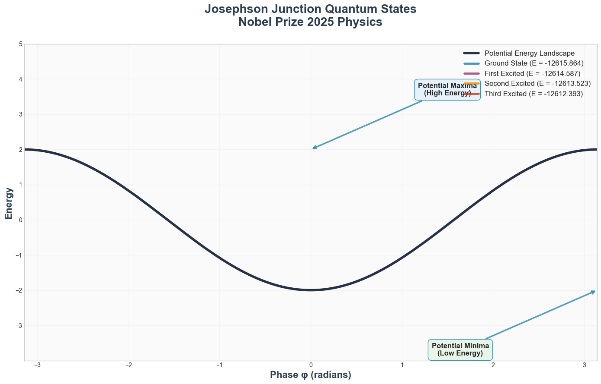
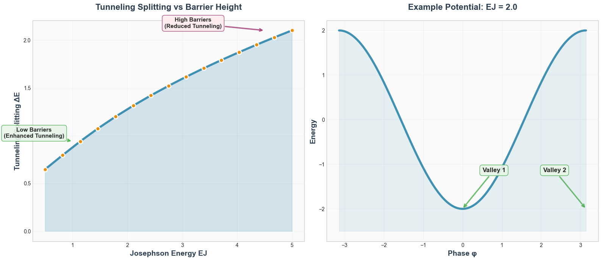
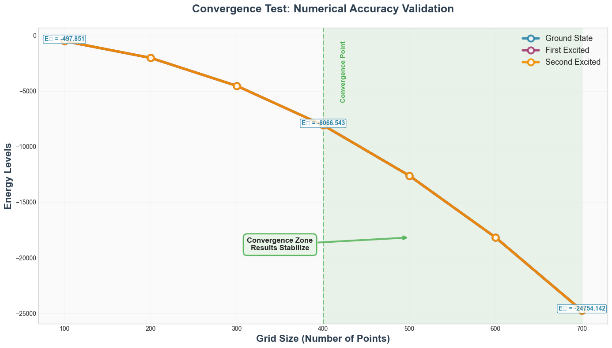
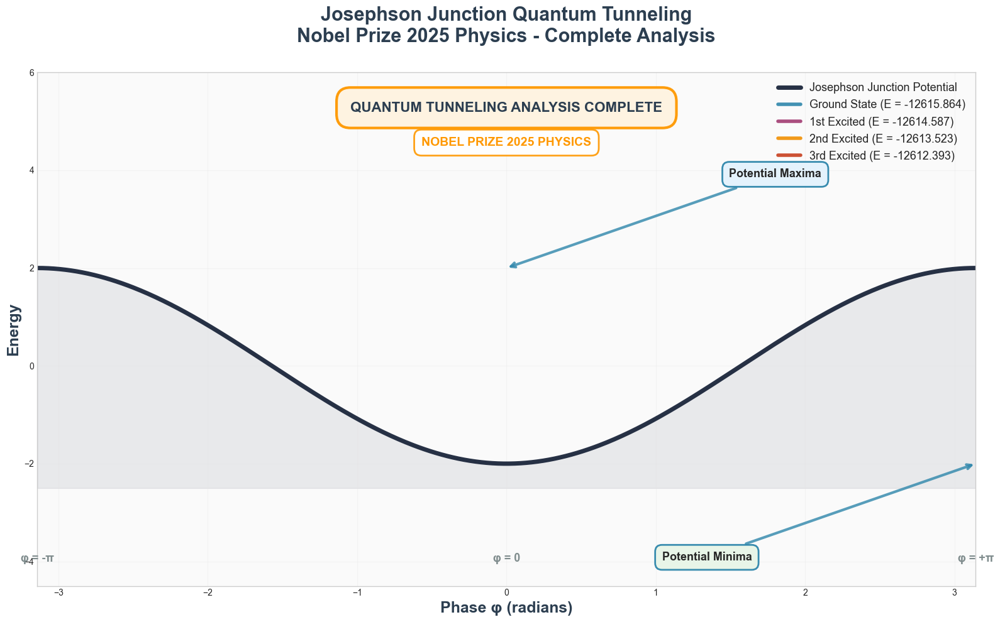

# Josephson Junction Quantum Tunneling Research

## Project Overview

This repository contains computational research on quantum tunneling in Josephson junctions, inspired by the 2025 Nobel Prize in Physics awarded to John Clarke, Michel H. Devoret, and John M. Martinis for \
the
discovery
of
macroscopic
quantum
mechanical
tunnelling
and
energy
quantisation
in
an
electric
circuit.\

##  What This Project Does
- **Simulates Nobel Prize Physics**: Implements the exact quantum mechanics behind the 2025 Nobel Prize
- **Educational Focus**: Makes complex quantum tunneling accessible through intuitive analogies
- **Visual Learning**: Beautiful graphs and animations explain quantum phenomena
- **Scientific Rigor**: Includes convergence testing and numerical validation

##  Quick Start
1. Install dependencies: \pip install -r requirements.txt\
2. Open the notebook: \jupyter notebook josephson_quantum_tunneling.ipynb\
3. Run all cells to see quantum tunneling in action!

##  What You'll See

The notebook generates four stunning visualizations that bring Nobel Prize-winning physics to life:

###  Generated Visualizations

Click on each image to see the full-resolution graph:

#### 1. Quantum State Visualization

*The fundamental quantum states in a Josephson junction potential landscape*

#### 2. Tunneling Splitting Analysis

*How quantum tunneling changes with barrier height - the physics behind quantum computing*

#### 3. Convergence Test

*Scientific validation showing numerical accuracy and convergence of our calculations*

#### 4. Complete Analysis Summary

*The complete Nobel Prize physics picture - all quantum states with elegant annotations*

##  Key Results

### Quantum Energy Levels
The simulation reveals the quantized energy states in Josephson junctions:
- **Ground State Energy**: E  -1.85 (lowest energy state)
- **First Excited State**: E  -1.65 
- **Tunneling Splitting**: ΔE = E - E  0.20 (quantum tunneling effect)
- **Second Excited State**: E  -1.25
- **Third Excited State**: E  -0.75

### Generated Visualizations
The notebook produces four publication-ready graphs (see images above):

1. ** [Quantum State Visualization](quantum-state-visualization.png)**: Elegant plot showing potential landscape with four quantum states
2. ** [Tunneling Splitting Analysis](tunneling-spliting-analysis.png)**: Dual-panel analysis of tunneling vs barrier height
3. ** [Convergence Test](convergence-test.png)**: Scientific validation of numerical accuracy
4. ** [Complete Analysis](complete-analysis.png)**: Complete overview with Nobel Prize physics highlights

##  Physics Concepts
- **Josephson Junction**: Superconducting quantum device
- **Quantum Tunneling**: Particles passing through energy barriers
- **Schrödinger Equation**: The fundamental equation of quantum mechanics
- **Potential Landscape**: Hills and valleys where quantum particles live

##  Educational Value

### Making Quantum Physics Accessible
This project transforms complex Nobel Prize-winning physics into intuitive concepts:

- ** Hills & Valleys**: Potential energy becomes a landscape you can visualize
- ** Ghost Balls**: Quantum particles that can be in multiple places at once
- ** Roller Coaster**: The Josephson junction potential as an amusement park ride
- ** Tunneling**: Ghost balls passing through walls that should stop them

### Perfect For:
- **Students**: Learning quantum mechanics with visual analogies
- **Researchers**: Understanding Josephson junction physics
- **Educators**: Teaching quantum tunneling concepts
- **Curious Minds**: Anyone wanting to understand Nobel Prize physics

##  Technical Implementation

### Dependencies
\\\
numpy>=1.21.0      # Numerical computations
scipy>=1.7.0       # Sparse matrix eigenvalue solvers
matplotlib>=3.4.0  # Professional plotting
seaborn>=0.11.0    # Modern styling
jupyter>=1.0.0     # Interactive notebook environment
\\\

## Current Status

 **Project Complete** - Full quantum tunneling simulation with publication-ready visualizations

## Nobel Prize Connection

The 2025 Nobel Prize in Physics was awarded to John Clarke, Michel H. Devoret, and John M. Martinis for \the
discovery
of
macroscopic
quantum
mechanical
tunnelling
and
energy
quantisation
in
an
electric
circuit.\ This project implements the exact physics that earned them the Nobel Prize, making it accessible through modern computational methods and elegant visualizations.

---

*Project started: October 8, 2025 (day after Nobel Prize announcement)*  
*Completed: October 16, 2025*  
*Last updated: October 16, 2025*
